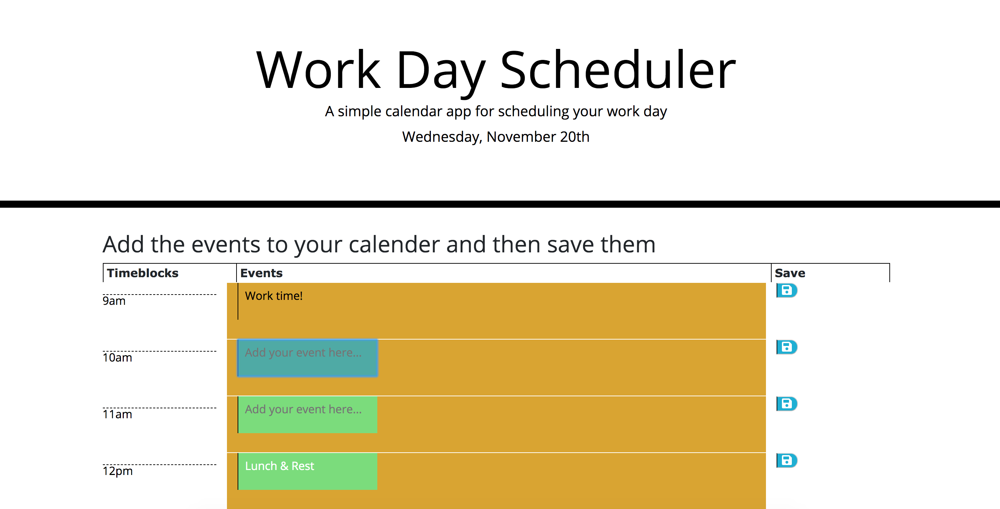

# Day-Planner
As an employee with a busy schedule
I want to add important events to a daily planner,
so that I can manage my time effectively.
Given that an employee adds events to a specific hour in a calendar.
When the employee clicks the save button,
then events are saved in the timeblock for that hour.
https://jmrosenberg12.github.io/Day-Planner/

